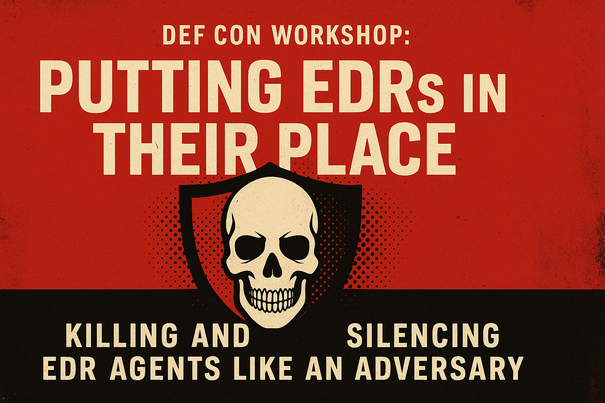

# 🛡️ DEFCON Workshop: Putting EDRs in Their Place  
### 💀 Killing and Silencing EDR Agents Like an Adversary

- ### [Setup](0-setup/README.md)
- ### [EDR Killing](1-edr-killing/README.md)
- ### [Custom EDR Evasion](2-custom-edr-evasion/README.md)
## 🎯 What You’ll Do

Each student will be provisioned their own lab environment to:
- 🔍 Investigate a live EDR agent: discover its hooks, logs, and reach
- ⚔️ Compile & deploy EDR killers used by known threat groups
- 🔕 Silence the agent-to-tenant communication path (shhh...)
- 🧠 Reverse engineer tool behaviors in real time
- 🛠️ Write custom C/C++ code to replicate evasion techniques
- 🧬 Build your own EDR killer and silencer—like a boss

## 👨‍💻 Format

✔️ Hands-on labs in your own hosted VM  
✔️ Pre-loaded tools, samples, and EDR emulator  
✔️ Instructor-led reverse engineering and live coding  
✔️ No filler. Just killin’.

## 💻 Requirements

Make sure you're ready to go with:
- ✅ A modern browser (for the hosted lab)
- ✅ Some knowledge of C/C++ (or willingness to jump in)
- ✅ Passion for pain, pointers, and patchless pwnage

## 🛠️ Tools & Techniques Covered

| Category             | Topics Covered |
|----------------------|----------------|
| 🧬 Evasion            | Inline hooking, API tracing, userland stealth |
| 🪓 EDR Kill Chains    | Process injection, thread hijacking, process tampering |
| 🛡️ Silencing Agents   | Blocking telemetry, stalling callbacks, tenant comms kill |
| 🧱 BYOVD              | Custom driver loading, kernel tampering, stealth access |
| 🔬 RE + Dev           | Dissecting EDR binaries, writing your own bypass toolsets |

---

## I. 👋 Introduction (10 min) — *Ryan & Aaron*

- Welcome and introductions
- Workshop overview:
  - 🔍 **Our focus:** EDR killing vs. silencing — what’s the difference, who uses these tactics, and why?
  - 🧰 Tools & techniques preview
  - 🧪 Structure:
    - Use and analyze real-world tools
    - Write your own weaponized versions
- 👑 Ground rules:
  - Participate, ask questions, stay respectful, share thoughts!

---

## II. 🧱 Environment Setup (25 min) — *Aaron*

**Goal:** Get your personal lab ready for action.

- 🔗 GitHub lab instructions
- 🧪 Pluralsight Lab: Setup free accounts
- ✅ Verify lab access
- 🛠️ Troubleshooting help if needed

---

## III. 🧠 Introduction to OpenEDR (40 min) — *Ryan*

**Goal:** Understand the EDR we’ll be targeting.

- What is [OpenEDR](https://www.openedr.com/)? Why it was selected? Alternatives?
- 🧬 OpenEDR internals:
  - Logging behavior
  - Detection capabilities
- 🧪 Run some commands → Analyze logs

---

## IV. 💣 EDR Killing with EDRSandBlast (20 min) — *Ryan*

**Goal:** Use a real-world EDR killer tool seen in ransomware campaigns.

- Overview of [EDRSandBlast](https://github.com/wavestone-cdt/EDRSandblast)
- 👨‍💻 Code walkthrough in Visual Studio
- 🔨 Build it
- 🚀 Execute it:
  - Run post-exploit commands → verify nothing is logged
- 🩹 Disable EDRSandBlast → see logs come back online

---

## V. 🕶️ EDR Silencing Methods (25 min) — *Ryan*

**Goal:** Disable EDR telemetry *without killing the agent.*

- 📡 Silencing techniques:
  - `Add-DnsClientNrptRule`
  - `GenericDNSServers` registry key
  - *(If time)* `PendingFileRenameOperations`
- ✅ Verify agent stays "alive" but blind

---

## ☕ BREAK (15 min)

Take a breather. Stretch. Reflect on what you’ve just done to that poor EDR.

---

## VI. 🔧 Writing an EDR Killer (45 min) — *Aaron*

**Goal:** Create your own killer using BYOVD (Bring Your Own Vulnerable Driver)

- 🔍 Walkthrough:
  - Analyze & edit pre-provided code snippets
  - Live code augmentation
  - Compile & test
- 💀 Use custom code to destroy OpenEDR
- 🔬 Discussion:
  - Readily-available tools vs. DIY bypasses

---

## VII. 🤫 Writing an EDR Silencer (45 min) — *Aaron*

**Goal:** Quiet the EDR via code — not commands.

- 🧠 Strategy:
  - Use API calls to avoid detection
  - Replace LOLBins with low-noise native methods
- 🛠️ Live lab:
  - Modify and compile silencer code
  - Test against OpenEDR agent
- 🧩 Takeaways:
  - Code-level silencing = longer dwell time

---

## VIII. 🎤 Wrap-Up (15 min) — *Aaron*

- 💬 Open discussion & Q&A
- 🧭 What’s next for Aaron & Ryan
- 👋 Goodbyes & DEFCON love
- 💀 #RansomwareSucks stickers and war stories encouraged

